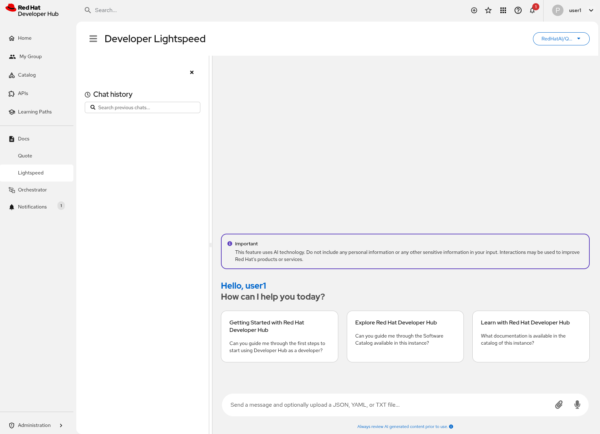

# Enabling Red Hat Developer Lightspeed

Red Hat Developer Lightspeed is an AI-powered assistant integrated into Red Hat Developer Hub that helps developers
interact with the Software Catalog, TechDocs, and other Developer Hub features through natural language queries.
This exercise walks you through the integration process.

For detailed information, refer to the [official documentation](https://docs.redhat.com/en/documentation/red_hat_developer_hub/1.8/html-single/interacting_with_red_hat_developer_lightspeed_for_red_hat_developer_hub/index#con-about-developer-lightspeed_developer-lightspeed).

## Table of Contents

- [Overview](#overview)
- [Configure RBAC Permissions](#configure-rbac-permissions)
- [Configure Lightspeed Services](#configure-lightspeed-services)
- [Update Red Hat Developer Hub Configuration](#update-red-hat-developer-hub-configuration)
- [Verify the Installation](#verify-the-installation)
- [Test Developer Lightspeed](#test-developer-lightspeed)
- [References](#references)

## Overview

The Lightspeed integration consists of several components:

- **Lightspeed Core Service (LCS)**: The backend service that handles AI interactions
- **PostgreSQL Database**: (Optional) External database to store chat histories from users and managed by LCS
- **Llama Stack**: Provides the LLM (Large Language Model) capabilities for processing queries
- **MCP (Model Context Protocol) Tools**: Enable Lightspeed to interact with Red Hat Developer Hub catalog and TechDocs
- **Dynamic Plugin**: The UI component that provides the chat interface in Developer Hub

## Configure RBAC Permissions

Before applying the Lightspeed configuration, you need to add Lightspeed-specific permissions to your RBAC policy.
These permissions allow users to interact with the Lightspeed chat feature.

Add the following permissions to your RBAC policy ConfigMap to allow users to read, create and delete chat conversations:

```text
# Lightspeed permissions
p, role:default/team-a, lightspeed.chat.read, read, allow
p, role:default/team-a, lightspeed.chat.create, create, allow
p, role:default/team-a, lightspeed.chat.delete, delete, allow
p, role:default/team-b, lightspeed.chat.read, read, allow
p, role:default/team-b, lightspeed.chat.create, create, allow
p, role:default/team-b, lightspeed.chat.delete, delete, allow
```

Apply the updated RBAC policy ConfigMap that includes Lightspeed permissions:

```bash
oc apply -f ./custom-app-config-gitlab/rbac-policy-configmap-15.yaml
```

## Configure Lightspeed Core Services

This step creates the necessary secrets and configuration for the Lightspeed backend services.

The Llama Stack secret contains configuration for connecting to the LLM service that powers Lightspeed's AI capabilities.

Create a secret with an app id and secret:

```yaml
apiVersion: v1
kind: Secret
metadata:
  name: llama-stack-secrets
  namespace: rhdh-gitlab
type: Opaque
stringData:
  VLLM_TLS_VERIFY: ""
  VALIDATION_PROVIDER: "vllm"
  VLLM_MAX_TOKENS: ""
  VLLM_URL: REPLACE_IT
  VLLM_API_KEY: REPLACE_IT
  VALIDATION_MODEL_NAME: REPLACE_IT
```

The `llama-stack-secrets` Secret contains:

- `VLLM_URL`: The endpoint URL for the LLM service
- `VLLM_API_KEY`: Authentication key for the LLM service
- `VALIDATION_MODEL_NAME`: The specific model to use
- `VALIDATION_PROVIDER`: The provider type (e.g., `vllm`)

**NOTE**: Review and update the values in this file to match your LLM service configuration before applying.

You can create the `ls-llama-stack-secrets.yaml` inside of `custom-app-config-gitlab` folder and run:

```bash
oc apply -f ./custom-app-config-gitlab/ls-llama-stack-secrets.yaml -n rhdh-gitlab
```

By default LCS will use a SQLlite instance to persist the chat histories. However, if the pod is restarted,
all conversations will be lost. In this scenario, we will create an external PostgreSQL database to persist
all conversations independently of Red Hat Developer Hub pod lifecycle.

**NOTE**: There are different ways to install a PostgreSQL database on OpenShift. For demo purposes of this
workshop, we will use an experimental Helm Chart available in Red Hat OpenShift. Don't use it in production
environments.

Enable in your terminal the OpenShift Helm Charts repository, or update it if you have already installed:

```bash
helm repo add openshift-helm-charts https://charts.openshift.io/
helm repo update openshift-helm-charts
```

To setup the configuration of the PostgreSQL database instance, the [postgresql-rhdh-ls-values.yaml](./custom-app-config-gitlab/postgresql-rhdh-ls-values.yaml)
provides an initial configuration like this:

```yaml
database_service_name: postgresql-rhdh-ls
config:
  port: 5432
  postgresql_database: rhdh-ls
  postgresql_user: lightspeed
  postgresql_password: l1ghtsp33d
image:
  tag: "15-el9"
memory_limit: 1Gi
volume_capacity: 1Gi
```

To install the PostgreSQL database instance will require to install the following Helm Releases:

```bash
helm upgrade -i postgresql-imagestreams \
  openshift-helm-charts/redhat-postgresql-imagestreams \
  --namespace rhdh-gitlab

helm upgrade -i postgresql-rhdh-ls \
  -f ./custom-app-config-gitlab/postgresql-rhdh-ls-values.yaml \
  openshift-helm-charts/redhat-postgresql-persistent \
  --history-max=4 \
  --namespace rhdh-gitlab
```

**TIP**: The `postgresql-rhdh-ls` secret is values to connect to the database: `database-name`, `database-password`, `database-user`.

Export the default configuration to be used in the LCS connection configuration:

```bash
export POSTGRESQL_RHDH_LS_USER_B64=$(echo -n "lightspeed" | base64 -w0)
export POSTGRESQL_RHDH_LS_PASSWORD_B64=$(echo -n "l1ghtsp33d" | base64 -w0)

oc patch secret rhdh-secrets -n rhdh-gitlab -p '{"data":{"POSTGRESQL_RHDH_LS_USER":"'"$POSTGRESQL_RHDH_LS_USER_B64"'","POSTGRESQL_RHDH_LS_PASSWORD":"'"$POSTGRESQL_RHDH_LS_PASSWORD_B64"'"}}'
```

The Lightspeed Stack ConfigMap contains the configuration for the Lightspeed Core Service, including service
settings, storage paths, and MCP server connections.

```bash
oc apply -f ./custom-app-config-gitlab/ls-stack-configmap-15.yaml -n rhdh-gitlab
```

The `lightspeed-stack` ConfigMap contains:

- Service configuration (host, port, workers)
- Llama Stack connection settings
- User data collection settings (feedback, transcripts)
- Conversation cache configuration
- MCP server endpoint configuration

**NOTE**: Update the MCP server URL in the ConfigMap to match your Developer Hub route URL.

The Lightspeed App Config contains the frontend configuration for the Lightspeed plugin,
including MCP server tokens, custom prompts, and Content Security Policy (CSP) settings.

```bash
oc apply -f ./custom-app-config-gitlab/ls-app-config-configmap-15.yaml -n rhdh-gitlab
```

The `lightspeed-app-config` ConfigMap named contains:

- CSP (Content Security Policy) settings for the frontend
- MCP server authentication token
- Optional custom user prompts for the chat interface
- Optional service port and system prompt overrides

## Update Red Hat Developer Hub Configuration

This step updates the Developer Hub instance to enable Lightspeed plugins and deploy the necessary sidecar containers.

Enable the Lightspeed plugins:

```bash
oc apply -f ./custom-app-config-gitlab/dynamic-plugins-15.yaml -n rhdh-gitlab
```

Apply the updated Backstage Custom Resource that adds the Lightspeed sidecar containers and configuration:

```bash
oc apply -f ./custom-app-config-gitlab/rhdh-instance-15.yaml -n rhdh-gitlab
```

This part is required to add manually a set of new init containers and side container to create the full architecture
of this solution:

- Add an **init container** (`init-rag-data`) that copies RAG (Retrieval-Augmented Generation) data and embeddings model to a shared volume
- Add **llama-stack sidecar container** that provides LLM capabilities
- Add **lightspeed-core sidecar container** that runs the Lightspeed Core Service
- Mount the `lightspeed-stack` ConfigMap and `lightspeed-app-config` ConfigMap
- Create shared storage volumes for data persistence (feedback, transcripts, conversations, RAG data)

## Verify the Installation

After applying all configurations, verify that the Lightspeed integration is working:

1. **Check that all pods are running**:

   ```bash
   oc get pods -l rhdh.redhat.com/app=backstage-developer-hub -n rhdh-gitlab
   ```

   You should see containers for `backstage-backend`, `llama-stack`, and `lightspeed-core` in the pod.

2. **Verify the Lightspeed plugin is loaded**:

   ```bash
   oc logs deployment/backstage-developer-hub -c backstage-backend -n rhdh-gitlab | grep -i lightspeed
   ```

3. **Access the Lightspeed UI**:

   - Navigate to your Red Hat Developer Hub URL
   - Look for the "Lightspeed" menu item in the navigation
   - Click on it to open the chat interface

   A similar interface like this one should appear:

   

## Test Developer Lightspeed

Once the installation is complete and all pods are running, you can test the Lightspeed integration
by asking questions in the chat interface. Here are some example queries you can try:

* **Catalog Queries**:

  - "Could you list the templates available in the Red Hat Developer Hub Catalog?"
  - "Could you list the components of the Red Hat Developer Hub catalog where the owner is the `team-a`?"

* **TechDocs Queries**:

  - "Fetch all techdocs from the Red Hat Developer Hub server. List only name, title and description."
  - "What is the coverage of techdocs in the default namespace?"
  - "Fetch page `index.html` from techdoc with reference `component:default/my-sample`"

* **General Queries**:

  - "Can you guide me through the first steps to start using Developer Hub as a developer?"
  - "Can you guide me through the Software Catalog and add my service?"
  - "Can you guide me through the Technical Docs of the Catalog?"

These queries demonstrate how Lightspeed can interact with the Developer Hub catalog and TechDocs through
the MCP tools, providing AI-powered assistance for navigating and understanding your software catalog.

## References

- [Interacting with Red Hat Developer Lightspeed for Red Hat Developer Hub](https://docs.redhat.com/en/documentation/red_hat_developer_hub/1.8/html-single/interacting_with_red_hat_developer_lightspeed_for_red_hat_developer_hub/index)
- [About Developer Lightspeed](https://docs.redhat.com/en/documentation/red_hat_developer_hub/1.8/html-single/interacting_with_red_hat_developer_lightspeed_for_red_hat_developer_hub/index#con-about-developer-lightspeed_developer-lightspeed)
