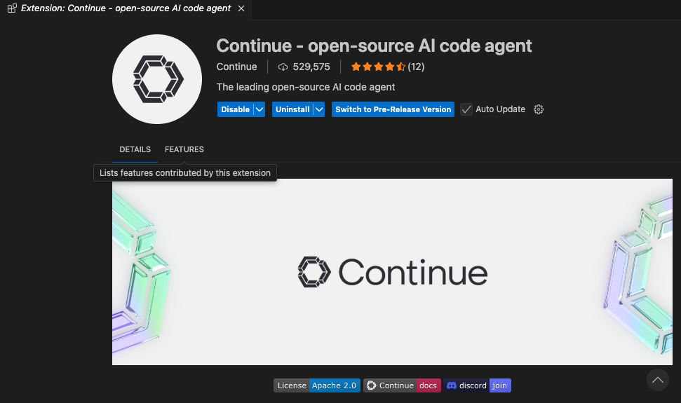
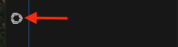
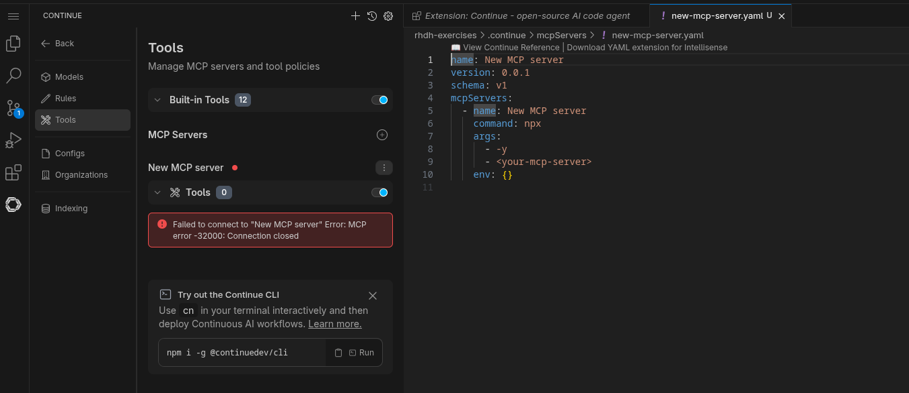
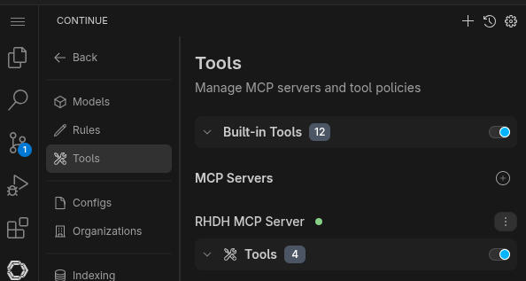
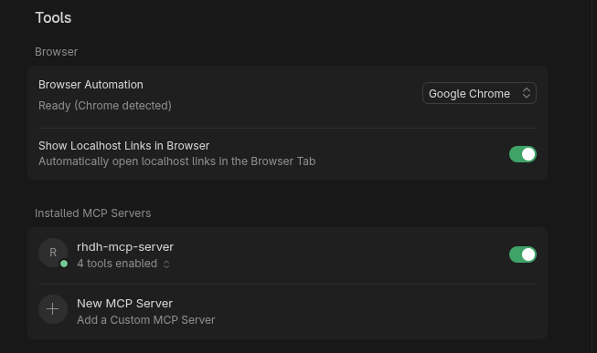
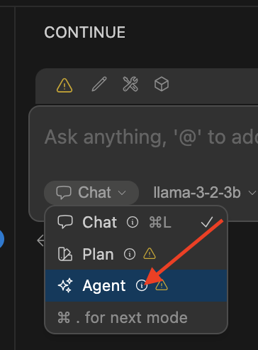

# AI Labs - Enable Model Context Protocol (MCP)

## Table of Contents

- [Overview](#ai-labs---enable-model-context-protocol-mcp)
- [Integrate your AI client with Red Hat Developer Hub MCP Server](#integrate-your-ai-client-with-red-hat-developer-hub-mcp-server)
  - [Using Continue](#using-continue)
    - [Add Red Hat Developer Hub MCP configuration](#add-red-hat-developer-hub-mcp-configuration)
    - [Add LLM in the AI Assistant](#add-llm-in-the-ai-assistant)
  - [Using Cursor](#using-cursor)
- [Testing the model and MCP](#testing-the-model-and-mcp)
- [References](#references)

Since Red Hat Developer Hub 1.8, there is a Developer Preview feature to integrate it with AI
clients by Model Context Protocol (MCP) server. This feature provides a standardized method
for AI applications to access Red Hat Developer Hub information and workflows through defined MCP tools.

MCP is a standardized method for linking AI models and applications (MCP clients) with external
systems (MCP servers). This connection facilitates access to information and workflows residing on
those systems. MCP servers are responsive for defining the tools that MCP clients can interact with.

Red Hat Developer Hub supports running MCP tools through the `mcp-actions-backend` plugin. To enable
it we need to add the following dynamic plugins:

```yaml
      - package: oci://ghcr.io/redhat-developer/rhdh-plugin-export-overlays/backstage-plugin-mcp-actions-backend:bs_1.42.5__0.1.2!backstage-plugin-mcp-actions-backend
        disabled: false
      - package: oci://ghcr.io/redhat-developer/rhdh-plugin-export-overlays/red-hat-developer-hub-backstage-plugin-software-catalog-mcp-tool:bs_1.42.5__0.2.3!red-hat-developer-hub-backstage-plugin-software-catalog-mcp-tool
        disabled: false
      - package: oci://ghcr.io/redhat-developer/rhdh-plugin-export-overlays/red-hat-developer-hub-backstage-plugin-techdocs-mcp-tool:bs_1.42.5__0.3.0!red-hat-developer-hub-backstage-plugin-techdocs-mcp-tool
        disabled: false
```

Those plugins will enable the Software Catalog MCP and TechDocs MCP tools.

The **Software Catalog MCP** lists Backstage entities, such as `Components`, `Systems`, `Resources`,
`APIs`, `Locations`, `Users`, and `Groups`.

The **TechDocs MCP** tool enables MCP clients to search and retrieve documentation directly from TechDocs registered in Red Hat Developer Hub. The following TechDocs MCP tools are supported:
`fetch-techdocs`, `analyze-techdocs-coverage`, `retrieve-techdocs-content`.

To allow MCP clients to use the defined MCP tools and access the exposed capabilities of
Red Hat Developer Hub, we need to extend the configuration adding:

```yaml
  backend:
    auth:
      externalAccess:
        - type: static
          options:
            token: ${MCP_TOKEN}
            subject: mcp-clients
    actions:
      pluginSources:
        - software-catalog-mcp-tool
        - techdocs-mcp-tool            
```

The `MCP_TOKEN` is a static token for authentication against the MCP server endpoint. MCP clients
(such as Cursor, Continue, or Lightspeed Core) will use this token for authentication.

Generate the token and add it into the Red Hat Developer Hub secrets configuration can be done by:
 
```bash
export MCP_TOKEN=$(node -p 'require("crypto").randomBytes(24).toString("base64")' | base64 -w0)
oc patch secret rhdh-secrets -n rhdh-gitlab -p '{"data":{"MCP_TOKEN":"'"${MCP_TOKEN}"'"}}'
```

Apply the changes

```bash
oc apply -f ./custom-app-config-gitlab/dynamic-plugins-14.yaml -n rhdh-gitlab
oc apply -f ./custom-app-config-gitlab/rhdh-app-configmap-14.yaml -n rhdh-gitlab
```

## Integrate your AI client with Red Hat Developer Hub MCP Server

### Using Continue

For this example, we will use [Continue](https://www.continue.dev/) as our AI client to
verify the integration with the Red Hat Developer Hub MCP feature. As part of this
exercise we will use the VSCode extension.

**NOTE**: If you don't have a local VSCode instance running, you can use it a default workspace
provided by [Red Hat OpenShift Dev Spaces sandbox](https://developers.redhat.com/developer-sandbox).
Just create a "empty workspace" or just create importing this GitHub repository.

To install the Continue plugin just follow these steps:

* Click the `Extensions` icon.
* Search for the `Continue` extension and install the **Pre-Release** version.
* If you are asked, click the `Trust the Published and Install` button.
* After a successful installation, you will se a screen similar to this:


#### Add Red Hat Developer Hub MCP configuration

It is time to set up to integrate to Red Hat Developer Hub.

* Click the Continue icon: 
* Click the tools icon, in the tools window, click the plus icon to configure the MCP server.



* Complete the configuration adding the definition of Red Hat Developer Hub MCP server. This
configuration requires to use the `MCP_TOKEN` and the MCP server endpoint:

** To get the MCP Server endpoint:

```bash
echo https://$(oc get route backstage-developer-hub -n rhdh-gitlab -o jsonpath='{.spec.host}')/api/mcp-actions/v1
```

** Complete the configuration similar to this one:

```yaml
name: RHDH MCP server
version: 0.0.1
schema: v1
mcpServers:
  - name: RHDH MCP Server
    type: streamable-http
    url: <REPLACE-RHDH-HOST>/api/mcp-actions/v1
    requestOptions:
      headers:
        Authorization: "Bearer <REPLACE-MCP-TOKEN>"
```

** If the configuration is successful a green icon should appear near to the MCP server:



#### Add LLM in the AI Assistant

To complete the integration, we need to add a LLM into our AI Assistant. 

**NOTE:** If you have your own model to use (e.g: Gemini, OpenAI), continue the configuration using the values and
structured based on your own model. In the case, you don't have your own self-hosted model
and you are a Red Hatter, you can use an instance provided by the MaaS (Model as a Service)
from the Red Hat AI BU. This is not an official Red Hat Service. It is for Red Hat associates'
internal demo purposes only, provided 'as-is' without support or SLA.

* Access the URL and sign in with your Red Hat account: [MaaS website](https://maas.apps.prod.rhoai.rh-aiservices-bu.com/).
* Click **Sign in** and **Authenticate with RH SSO**.
* Click **Google** to sign in to RHOAI, where the model is deployed with your account.
* Click **Applications** and **Create an Application**.
* Click the `llama-3-2-3b` model.
* Save the **API Key** and the **Endpoint URL** for later usage.

Back to your IDE to add your LLM model:

* Click the Continue icon.
* Click the **ADD Chat Model** option, then click **config file**
* A new file named `config.yaml` will be created.
* Copy the following content and paste it

```yaml
name: Local Assistant
version: 1.0.0
schema: v1
models:
  - name: llama-3-2-3b
    provider: openai
    model: llama-3-2-3b
    apiBase:
    apiKey: ""
    roles:
      - chat
      - edit
      - apply
tabAutocompleteModel:
  title: RamaLama (AutoComplete)
  provider: custom
  model: default
allowAnonymousTelemetry: false
context:
  - provider: code
  - provider: docs
  - provider: diff
  - provider: terminal
  - provider: problems
  - provider: folder
  - provider: codebase
```

* Copy the **Endpoint URL** from the MaaS website and paste it as value of the `apiBase` parameter. Include `/v1` at the end of the URL.
* Copy the **API Key** from the MaaS website and paste it as value of the `apiKey` parameter.

Now, your AI assistant is ready to be used.

### Using Cursor

[Cursor](https://cursor.sh/) is an AI-powered code editor that supports Model Context Protocol (MCP) servers. 
You can integrate Cursor with your Red Hat Developer Hub MCP server to enable AI assistants to query your 
software catalog, templates, and TechDocs directly from within Cursor.

To integrate Red Hat Developer Hub MCP server with Cursor:

1. **Create the MCP configuration file**: Run the following command to create the `mcp.json` file in the `.cursor` 
   directory.
   This command will automatically retrieve your Red Hat Developer Hub instance URL from
   the OpenShift route and use the `MCP_TOKEN` environment variable for authentication:

```bash
mkdir -p .cursor && cat > .cursor/mcp.json <<EOF
{
  "mcpServers": {
    "rhdh-mcp-server": {
      "url": "https://$(oc get route backstage-developer-hub -n rhdh-gitlab -o jsonpath='{.spec.host}')/api/mcp-actions/v1",
      "headers": {
        "Authorization": "Bearer ${MCP_TOKEN}"
      },
      "requestOptions": {
        "rejectUnauthorized": false,
        "strictSSL": false
      }
    }
  }
}
EOF
```

**Note**: Make sure the `MCP_TOKEN` environment variable is set before running this command.
If it's not set, you can retrieve it from the OpenShift secret:

```bash
export MCP_TOKEN=$(oc get secret rhdh-secrets -n rhdh-gitlab -o jsonpath='{.data.MCP_TOKEN}' | base64 -d)
```

2. **Restart Cursor**: After creating the configuration file, restart Cursor to load the MCP server connection.

3. **Verify the connection**: Once Cursor restarts, the MCP server should be connected.
You can verify this in Cursor's MCP settings, where you should see a green indicator confirming
the connection is active:



Once configured, you can use Cursor's AI assistant to query your Red Hat Developer Hub catalog,
fetch TechDocs, and interact with your software templates directly from the editor.

## Testing the model and MCP

First, lets confirm that we can interact with our AI assistant.

* Click the recently added model, and ask some easy, such as: `Hi!`
* Ensure **agent** is selected in the Continue terminal. This agent interacts with the MCP server tools.



Let's try some of the next queries:

* Could you list the templates available in the Catalog? 
* Fetch all techdocs from the Red Hat Developer Hub server
* Could you list the components of the Red Hat Developer Hub catalog where the owner is the `team-a`?
* What is the coverage of techdocs in the default namespace?
* Fetch page `index.html` from techdoc with reference `component:default/my-sample`

Try your own queries.

## References

- [Interacting with MCP tools for Red Hat Developer Hub](https://docs.redhat.com/en/documentation/red_hat_developer_hub/1.8/html-single/interacting_with_model_context_protocol_tools_for_red_hat_developer_hub/index)
