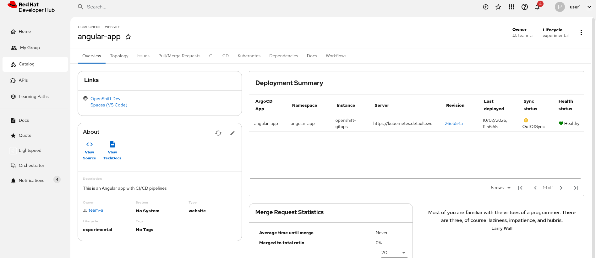
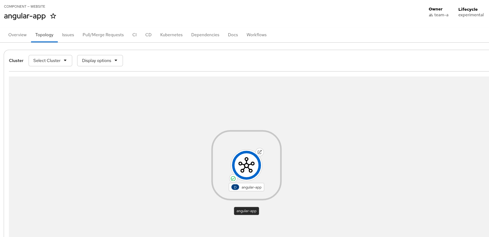
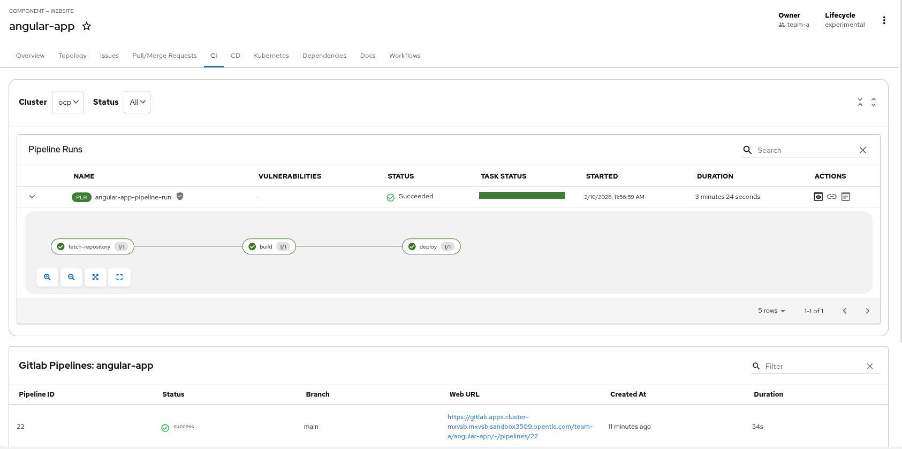
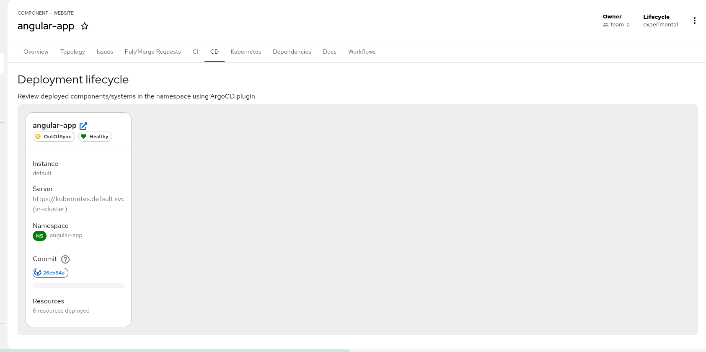
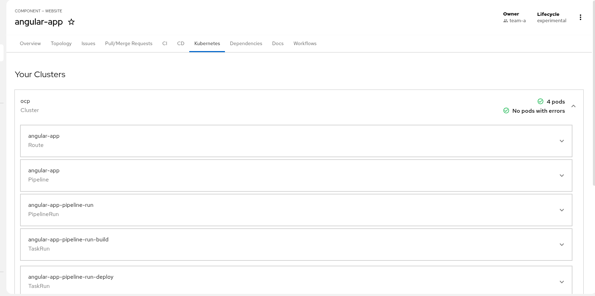
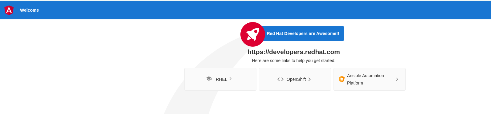

# Enterprise Labs - Enable CI/CD Pipelines

This exercise describes the main steps and commands to integrate **Red Hat Developer Hub** with
**Tekton** (CI), **Kubernetes**, and **Argo CD** (CD) using the dynamic plugins. In the Developer Hub
UI you can then visualize pipeline runs from Red Hat OpenShift Pipelines, deployment status from
Red Hat OpenShift GitOps, and OpenShift/Kubernetes resources. The exercise ends with onboarding a
sample **Angular application** and verifying the CI/CD and deployment tabs on its entity page.

## Table of Contents

- [Enterprise Labs - Enable CI/CD Pipelines](#enterprise-labs---enable-cicd-pipelines)
- [Prerequisites](#prerequisites)
  - [Install Red Hat OpenShift Pipelines operator](#install-red-hat-openshift-pipelines-operator)
  - [Install Red Hat OpenShift GitOps operator](#install-red-hat-openshift-gitops-operator)
  - [Default Argo CD instance location](#default-argo-cd-instance-location)
- [Integration with Argo CD](#integration-with-argo-cd)
- [Integration with Tokens](#integration-with-tokens)
- [Apply Red Hat Developer Hub configuration](#apply-red-hat-developer-hub-configuration)
- [Verify the installation](#verify-the-installation)
- [Entity Annotations](#entity-annotations)
- [References](#references)

## Prerequisites

- **Red Hat OpenShift Pipelines** operator installed.
- **Red Hat OpenShift GitOps** operator installed with the default Argo CD instance.

### Install Red Hat OpenShift Pipelines operator

[Red Hat OpenShift Pipelines](https://docs.redhat.com/en/documentation/red_hat_openshift_pipelines/) provides a cloud-native CI/CD solution based on Tekton.
The operator is installed in the `openshift-operators` namespace and is available cluster-wide.

Run:

```bash
oc apply -f ./custom-app-config-gitlab/pipelines-operator-17.yaml
```

The operator is installed in the `openshift-operators` namespace. Verify the status:

```bash
on 🎩 ❯ oc get csv -n openshift-operators -l operators.coreos.com/openshift-pipelines-operator-rh.openshift-operators=
NAME                                      DISPLAY                       VERSION   REPLACES                                  PHASE
openshift-pipelines-operator-rh.v1.21.0   Red Hat OpenShift Pipelines   1.21.0    openshift-pipelines-operator-rh.v1.20.2   Succeeded
```

Wait until the **PHASE** is `Succeeded` before continuing. You can also verify that the
`TektonConfig` and related resources are created:

```bash
on 🎩 ❯ oc get tektonconfig -A
NAME     VERSION   READY   REASON
config   1.21.0    True  
```

### Install Red Hat OpenShift GitOps operator

[Red Hat OpenShift GitOps](https://docs.redhat.com/en/documentation/red_hat_openshift_gitops/) uses Argo CD to implement continuous deployment for cloud-native applications.
The operator is installed in the `openshift-gitops-operator` namespace. After installation,
it **automatically creates a default Argo CD instance** that is ready to use.

Run:

```bash
oc apply -f ./custom-app-config-gitlab/gitops-operator-17.yaml
```

The operator is installed in the `openshift-gitops-operator` namespace. Verify the operator status:

```bash
on 🎩 ❯ oc get csv -n openshift-gitops-operator
NAME                                      DISPLAY                        VERSION    REPLACES                                  PHASE
openshift-gitops-operator.v1.19.1         Red Hat OpenShift GitOps       1.19.1     openshift-gitops-operator.v1.19.0         Succeeded
```

Wait until the **PHASE** is `Succeeded`.

### Default Argo CD instance location

The Red Hat OpenShift GitOps Operator automatically deploys a **default Argo CD instance** in
the **`openshift-gitops`** namespace. This is the cluster-scoped Argo CD instance used for GitOps workflows.

Verify that the default Argo CD instance and its pods are running:

```bash
oc get pods -n openshift-gitops
```

You should see pods such as `openshift-gitops-application-controller-0`, `openshift-gitops-server-*`, `openshift-gitops-repo-server-*`, and others.

To access the Argo CD web UI from the OpenShift console: **Applications** (or the application launcher) → **OpenShift GitOps** → **Cluster Argo CD**.
You can also obtain the Argo CD admin password from the secret in the `openshift-gitops` namespace:

```bash
oc get secret openshift-gitops-cluster -n openshift-gitops -o jsonpath='{.data.admin\.password}' | base64 -d
```

The instance is deployed in the `openshift-gitops` namespace and available at:

```bash
echo https://$(oc get route openshift-gitops-server -n openshift-gitops -o jsonpath='{.spec.host}')
```

## Integration with Argo CD

The Argo CD plugin needs the URL and credentials of your Argo CD instance.
Add them to the `rhdh-secrets` secret so the app config
can use `${ARGOCD_URL}`, `${ARGOCD_USERNAME}`, and `${ARGOCD_PASSWORD}`.

1. Argo CD URL - default OpenShift GitOps instance:

```bash
export ARGOCD_URL=$(oc get route openshift-gitops-server -n openshift-gitops -o jsonpath='https://{.spec.host}' 2>/dev/null || echo "https://openshift-gitops-server-openshift-gitops.${BASEDOMAIN}")
```

2. Argo CD admin and password credentials:

```bash
export ARGOCD_USERNAME="admin"
export ARGOCD_PASSWORD=$(oc get secret openshift-gitops-cluster -n openshift-gitops -o jsonpath='{.data.admin\.password}' | base64 -d)
```

3. Encode and patch `rhdh-secrets` to add those variables:

```bash
export ARGOCD_URL_B64=$(echo -n "$ARGOCD_URL" | base64 -w0)
export ARGOCD_USERNAME_B64=$(echo -n "$ARGOCD_USERNAME" | base64 -w0)
export ARGOCD_PASSWORD_B64=$(echo -n "$ARGOCD_PASSWORD" | base64 -w0)

oc patch secret rhdh-secrets -n rhdh-gitlab -p '{"data":{"ARGOCD_URL":"'"$ARGOCD_URL_B64"'","ARGOCD_USERNAME":"'"$ARGOCD_USERNAME_B64"'","ARGOCD_PASSWORD":"'"$ARGOCD_PASSWORD_B64"'"}}'
```

## Integration with Tokens

The integration with Tekton requires to add some credentials to be used also by the
Kubernetes plugin. It is needed to add some privileges to get objects from the OpenShift API.

1. Create a cluster role to read OpenShift objects:

```bash
oc apply -f ./custom-app-config-gitlab/clusterrole-rhdh-17.yaml -n rhdh-gitlab
```

2. Create a service account to connect to OpenShift:

```bash
oc create sa rhdh -n rhdh-gitlab
```

3. Assign the cluster role to the service account created:

```bash
oc adm policy add-cluster-role-to-user rhdh-read-only system:serviceaccount:rhdh-gitlab:rhdh
```

4. Create a secret to get a long-lived token to authenticate to OpenShift:

```bash
oc apply -f - <<EOF
apiVersion: v1
kind: Secret
metadata:
  name: rhdh-token
  namespace: rhdh-gitlab
  annotations:
    kubernetes.io/service-account.name: rhdh
type: kubernetes.io/service-account-token
EOF
```

5. Get token and add into the `rhdh-secrets` secret as another env var: 

```bash
export RHDH_TOKEN_SERVICE_ACCOUNT=$(oc get secret rhdh-token -o go-template='{{.data.token | base64decode}}' -n rhdh-gitlab | base64 -w0)
oc patch secret rhdh-secrets -n rhdh-gitlab -p '{"data":{"RHDH_TOKEN_SERVICE_ACCOUNT":"'"${RHDH_TOKEN_SERVICE_ACCOUNT}"'"}}'
```

6. Declare the API url of OpenShift into the `rhdh-secrets` secret:

```bash
export APIDOMAIN="api.${BASEDOMAIN#apps.}"
oc patch secret rhdh-secrets -n rhdh-gitlab -p '{"stringData":{"APIDOMAIN":"'"${APIDOMAIN}"'"}}'
```

## Apply Red Hat Developer Hub configuration

There are different areas to update in our Red Hat Developer Hub configuration:

1. Add the new RBAC rules for Tekton and Kubernetes plugins.
2. Declare the dynamic plugins required to enable them.
3. Declare the connection to OpenShift, Argo CD instances and Tekton properties 

Apply those changes:

```bash
oc apply -f ./custom-app-config-gitlab/rbac-policy-configmap-17.yaml -n rhdh-gitlab
oc apply -f ./custom-app-config-gitlab/dynamic-plugins-17.yaml -n rhdh-gitlab
oc apply -f ./custom-app-config-gitlab/rhdh-app-configmap-17.yaml -n rhdh-gitlab
```

## Verify the installation

To confirm the right installation of those plugins and their features are enabled,
we will create another entity using the `Angular Template for GitLab` template, which
is already available in our instance.

Create a new instance using the following inputs:

* Name: `angular-app`
* Description: `This is an Angular app with CI/CD pipelines`
* Owner: `team-a`
* Repository location: Output of `echo gitlab.${BASEDOMAIN}` (ensure `BASEDOMAIN` is set, e.g. your cluster base domain)
* Argo CD instance: `openshift-gitops` (default)

Ensure the `angular-app` namespace exists (the template may create it, or create it manually if needed).
Then trigger the first pipeline execution using the `PipelineRun` manifest from the repository:

```bash
oc apply -f "https://gitlab.${BASEDOMAIN}/team-a/angular-app/-/raw/main/deploy/base/pipelinerun.yaml" -n angular-app
```

After creation the following new tabs should appear in our entity dashboard:

* **Deployment Summary**: Overview of our Argo CD application status.



* **Topology** tab: Overview of the deployment topology of our application on OpenShift.



* **CI** tab: Summary of the Tekton PipelineRuns and GitLab Pipelines.



* **CD** tab: Argo CD applications and sync status.



* **Kubernetes** tab: Summary of the OpenShift objects associated to this application.



Once the pipeline was completed our application should be available from the **Topology** tab
and we should click the arrow to access it. A similar page should be available:



## Entity Annotations

There are some annotations which make the magic to integrate the entity with those plugins.
Those annotations are included in the `catalog-info.yaml`.

**Tekton (PipelineRuns / TaskRuns)**

- `backstage.io/kubernetes-id: <entity-name>` — ties the entity to Kubernetes resources.
- `tekton.dev/cicd: "true"` — enables Tekton CI/CD for this entity.

**Argo CD (applications)**

- `argocd/app-name: '<entity-name>'` — label selector used by Argo CD to find the application
- Optional: `argocd/instance-name: 'openshift-gitops'` if you use a non-default instance name in app config.

Example snippet:

```yaml
metadata:
  name: my-service
  annotations:
    backstage.io/kubernetes-id: my-service
    tekton.dev/cicd: "true"
    argocd/app-name: 'angular-app'
```

## References

- [Configuring dynamic plugins (RHDH 1.8)](https://docs.redhat.com/en/documentation/red_hat_developer_hub/1.8/html-single/configuring_dynamic_plugins/index)
- [Installing and configuring Argo CD](https://docs.redhat.com/en/documentation/red_hat_developer_hub/1.8/html/configuring_dynamic_plugins/assembly-installing-configuring-argo-cd)
- [Dynamic plugins reference (Tekton, Argo CD, Kubernetes)](https://docs.redhat.com/en/documentation/red_hat_developer_hub/1.8/html-single/dynamic_plugins_reference/index)
- [Red Hat OpenShift Pipelines](https://docs.redhat.com/en/documentation/red_hat_openshift_pipelines/)
- [Red Hat OpenShift GitOps](https://docs.redhat.com/en/documentation/red_hat_openshift_gitops/)
- [Installing Red Hat OpenShift GitOps](https://docs.redhat.com/en/documentation/red_hat_openshift_gitops/1.19/html-single/installing_gitops/)
- [Setting up an Argo CD instance](https://docs.redhat.com/en/documentation/red_hat_openshift_gitops/1.19/html-single/argo_cd_instance/) (default instance is in `openshift-gitops`)
- [Backstage Kubernetes plugin — cluster service account token](https://backstage.io/docs/features/kubernetes/configuration#clustersserviceaccounttoken-optional)
