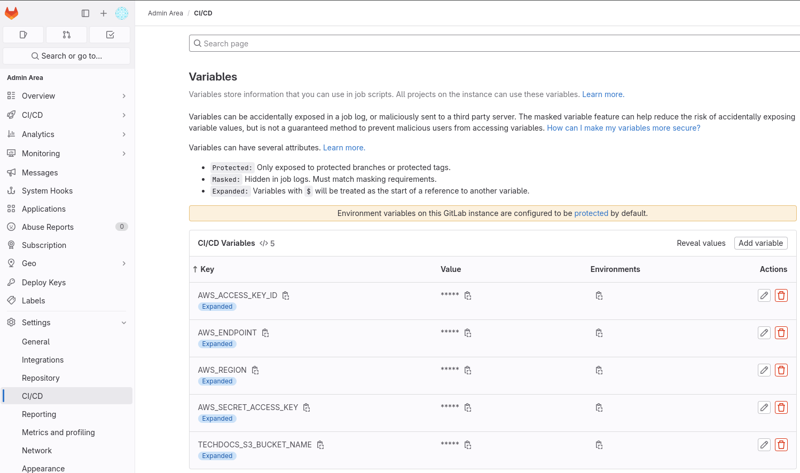

# Red Hat Developer Hub Workshop integrated with GitLab

## Mandatory settings

When Red Hat Developer Hub is installed via the operator there are some mandatory settings that need to be set:

- create mandatory backend secret
- add the `basedomain` to enable proper navigation and CORs settings

Customizing the instance requires a custom application file defined in a ConfigMap object. Additionally we can use a
Secret object to store sensitive data required by Red Hat Developer Hub. An example of sensitive data required is
the `BACKEND_SECRET` variable. That variable contains a mandatory backend authentication key.

Creating a Secret including that variable, and adding the base domain of our instance can be done running:

```sh
oc apply -f ./custom-app-config-gitlab/rhdh-secrets.yaml -n rhdh-gitlab
oc patch secret rhdh-secrets -n rhdh-gitlab -p '{"stringData":{"basedomain":"'"${basedomain}"'"}}'
```

**TIP**: Since Red Hat Developer Hub 1.6 is not longer required to define base URL for the instance. The operator will
calculate the correct value an inject in the default configuration. If you need it, you can still override these settings.
More details [here](https://docs.redhat.com/en/documentation/red_hat_developer_hub/1.6/html-single/red_hat_developer_hub_release_notes/index#enhancement-rhidp-6173)

This is the structure of the `app-config-rhdh` ConfigMap to customize the configuration of our Red Hat Developer Hub instance:

```yaml
kind: ConfigMap
apiVersion: v1
metadata:
  name: app-config-rhdh
data:
  app-config-rhdh.yaml: |
    app:
      title: My Red Hat Developer Hub Instance
      baseUrl: https://backstage-developer-hub-rhdh-gitlab.${basedomain}
    backend:
      auth:
        keys:
          - secret: ${BACKEND_SECRET}
      #baseUrl: https://backstage-developer-hub-rhdh-gitlab.${basedomain}
      #cors:
      #  origin: https://backstage-developer-hub-rhdh-gitlab.${basedomain}
```

Once created the ConfigMap and Secret, we can add them into the `developer-hub` CR Red Hat Developer Hub manifest:

```yaml
spec:
  application:
    appConfig:
      configMaps:
      - name: app-config-rhdh
    extraEnvs:
      secrets:
      - name: rhdh-secrets
```

or run this:

```sh
oc apply -f ./custom-app-config-gitlab/rhdh-app-configmap-0.yaml -n rhdh-gitlab
oc apply -f ./custom-app-config-gitlab/rhdh-instance-0.yaml -n rhdh-gitlab
```

**ATTENTION**: Red Hat Developer Hub has a slow startup as it is building and loading the dynamic plugins. Every time
we apply a [change in the configuration](https://docs.redhat.com/en/documentation/red_hat_developer_hub/1.3/html-single/release_notes/index#feature-rhidp-3569),
an automatic redeploy will start, and it will few minutes until
the new pod is ready to serve request. Please, be patient after any change before confirming they are
correctly applied.

More detailed information about this step [here](https://docs.redhat.com/en/documentation/red_hat_developer_hub/1.5/html-single/configuring_red_hat_developer_hub/index#provisioning-and-using-your-custom-configuration).

## Enable GitLab authentication

Enabling GitLab authentication requires to create a GitLab application within our GitLab instance. This
process is described [here](https://backstage.io/docs/auth/gitlab/provider), however, keep in mind to
execute the actions in your GitLab instance:

- GitLab UI navigation: Edit `Profile` -> `Applications` -> `Add new application`
- name: `rhdh-exercises`
- Redirect URI: copy output `echo https://backstage-developer-hub-rhdh-gitlab.${basedomain}/api/auth/gitlab/handler/frame`
- set the correct permissions: `api`, `read_user`, `read_repository`, `write_repository`, `openid`, `profile`, `email`

**NOTE**: Use the `root` user of GitLab to create this application.

Create a secret with an app id and secret:

```yaml
kind: Secret
apiVersion: v1
metadata:
  name: gitlab-secrets
  namespace: rhdh-gitlab
stringData:
  AUTH_GITLAB_CLIENT_ID: REPLACE_WITH_YOUR_GITLAB_CLIENT_ID
  AUTH_GITLAB_CLIENT_SECRET: REPLACE_WITH_YOUR_GITLAB_CLIENT_SECRET
type: Opaque
```

You can create the `gitlab-secrets.yaml` inside of `custom-app-config-gitlab` folder and run:

```sh
oc apply -f ./custom-app-config-gitlab/gitlab-secrets.yaml -n rhdh-gitlab
```

**NOTE**: If you want to create this secret in the OpenShift Web Console, you need to base64-decode the "`CLIENT ID`" and "`CLIENT SECRET`" values.

Modify `app-config` section of the `app-config-rhdh` ConfigMap with environment variables from the new secret:

```yaml
    signInPage: gitlab
    auth:
      environment: production
      providers:
        gitlab:
          development:
            clientId: ${AUTH_GITLAB_CLIENT_ID}
            clientSecret: ${AUTH_GITLAB_CLIENT_SECRET}
            audience: https://gitlab.${basedomain}
            signIn:
              resolvers:
                - resolver: usernameMatchingUserEntityName
                  dangerouslyAllowSignInWithoutUserInCatalog: true
```

Notice that we set the `signInPage` to `gitlab`, the default is `github`.

Next, add the new secret to the backstage manifests:

```yaml
spec:
  application:
    ...
    extraEnvs:
      secrets:
        - name: gitlab-secrets
```

Or execute:

```sh
oc apply -f ./custom-app-config-gitlab/rhdh-app-configmap-1.yaml -n rhdh-gitlab
oc apply -f ./custom-app-config-gitlab/rhdh-instance-1.yaml -n rhdh-gitlab
```

> **_NOTE:_** To disable guest login set the `environment` to `production`!

Verify that you can login with GitLab.

## Enable GitLab plugin integration

The GitLab integration has a special entity provider for discovering catalog entities from GitLab. The entity provider
will crawl the GitLab instance and register entities matching the configured paths. This can be useful as an alternative
to static locations or manually adding things to the catalog.

More information about Dynamic Plugins [here](https://docs.redhat.com/en/documentation/red_hat_developer_hub/1.4/html-single/installing_and_viewing_plugins_in_red_hat_developer_hub/index).

To enable the GitLab integration and discovery capabilities a Personal Access Token (aka PAT) is required.

Create new Personal Access Token (aka PAT) in menu `Access Tokens` of the GitLab user profile:

- GitLab UI navigation: Edit Profile -> Access Tokens -> Add new token
- name: `pat-rhdh-exercises`
- expiration date: Disabled it or just one in the future
- set the scopes: `api`, `read_api`, `read_repository`, `write_repository`

**NOTE**: Use the `root` user of GitLab to create this application.

Add the PAT to the previously created `gitlab-secrets` secret:

```yaml
kind: Secret
apiVersion: v1
metadata:
  name: gitlab-secrets
  namespace: rhdh-gitlab
stringData:
  AUTH_GITLAB_CLIENT_ID: REPLACE_WITH_YOUR_GITLAB_CLIENT_ID
  AUTH_GITLAB_CLIENT_SECRET: REPLACE_WITH_YOUR_GITLAB_CLIENT_SECRET
  GITLAB_TOKEN: REPLACE_WITH_YOUR_PAT
type: Opaque
```

Add the following to the `app-config-rhdh` ConfigMap:

```yaml
kind: ConfigMap
apiVersion: v1
metadata:
  name: app-config-rhdh
data:
  app-config-rhdh.yaml: |
    app:
      title: My Red Hat Developer Hub Instance
    integrations:
      gitlab:
        - host: gitlab.${basedomain}
          token: ${GITLAB_TOKEN}
          apiBaseUrl: https://gitlab.${basedomain}/api/v4
          baseUrl: https://gitlab.${basedomain}
```

Or execute:

```sh
oc apply -f ./custom-app-config-gitlab/gitlab-secrets.yaml -n rhdh-gitlab
oc apply -f ./custom-app-config-gitlab/rhdh-app-configmap-2.yaml -n rhdh-gitlab
```

## Add GitLab autodiscovery

Once we have integrated GitLab with Red Hat Developer Hub, we need to enable the autodiscovery
capabilities of this provider. Very useful to load our catalog with repositories already created in
our GitLab server. That requires to enable the `backstage-plugin-catalog-backend-module-gitlab-dynamic`
dynamic plugin provided by Red Hat Developer Hub.

We will use a new ConfigMap to enable the dynamic plugins:

```sh
oc apply -f ./custom-app-config-gitlab/dynamic-plugins-3.yaml -n rhdh-gitlab
```

Add this to the `app-config-rhdh` ConfigMap:

```yaml
catalog:
  providers:
    gitlab:
      myGitLab:
        host: gitlab.${basedomain} # Identifies one of the hosts set up in the integrations
        apiBaseUrl: https://gitlab.${basedomain}/api/v4
        branch: main # Optional. Used to discover on a specific branch
        fallbackBranch: master # Optional. Fallback to be used if there is no default branch configured at the Gitlab repository. It is only used, if `branch` is undefined. Uses `master` as default
        skipForkedRepos: false # Optional. If the project is a fork, skip repository
        entityFilename: catalog-info.yaml # Optional. Defaults to `catalog-info.yaml`
        projectPattern: '[\s\S]*' # Optional. Filters found projects based on provided patter. Defaults to `[\s\S]*`, which means to not filter anything
        schedule: # optional; same options as in TaskScheduleDefinition
          # supports cron, ISO duration, "human duration" as used in code
          frequency: { minutes: 5 }
          # supports ISO duration, "human duration" as used in code
          timeout: { minutes: 15 }
```

Update the Red Hat Developer Hub manifest to use the new ConfigMap for plugins:

```yaml
spec:
  application:
  ...
    dynamicPluginsConfigMapName: dynamic-plugins-rhdh
```

Or run:

```sh
oc apply -f ./custom-app-config-gitlab/rhdh-app-configmap-3.yaml -n rhdh-gitlab
oc apply -f ./custom-app-config-gitlab/rhdh-instance-3.yaml -n rhdh-gitlab
```

Verify that the `sample-app` component is located on the `Catalog` page.

**TIP**: A similar message is registered in the Red Hat Developer Hub pod to confirm the number of projects scanned:

```text
{"class":"GitlabDiscoveryEntityProvider","level":"\u001b[32minfo\u001b[39m","message":"Processed 1 from scanned 1 projects.","plugin":"catalog","service":"backstage","span_id":"f957c3084bb63955","target":"GitlabDiscoveryEntityProvider:myGitLab","taskId":"GitlabDiscoveryEntityProvider:myGitLab:refresh","taskInstanceId":"06e6c7f9-1f7f-4f2e-a61b-52bc2614b279","timestamp":"2025-03-05 09:27:24","trace_flags":"01","trace_id":"cb4b00f3c9465893e015c5c4b2233d36"}
```

**NOTE**: Enabling the following plugins shows some tabs in each component published in a GitLab server. Those
tabs shows the issues, merge requests and other useful information from the repository hosted in the GitLab server.

```yaml
      # GitLab Integration Plugins
      - package: ./dynamic-plugins/dist/immobiliarelabs-backstage-plugin-gitlab-backend-dynamic
        disabled: false
      - package: ./dynamic-plugins/dist/immobiliarelabs-backstage-plugin-gitlab
        disabled: false
```

## Enable users/teams autodiscovery

The Red Hat Developer Hub catalog can be set up to ingest organizational data -- users and groups -- directly from GitLab.
The result is a hierarchy of User and Group entities that mirrors your org setup.

Once we have integrated GitLab with Red Hat Developer Hub, we need to enable the autodiscovery
capabilities of users and groups. That requires to enable the `backstage-plugin-catalog-backend-module-gitlab-org-dynamic`
dynamic plugin provided by Red Hat Developer Hub.

Run:

```sh
oc apply -f ./custom-app-config-gitlab/dynamic-plugins-4.yaml -n rhdh-gitlab
```

Add this to the ConfigMap:

```yaml
  catalog:
    providers:
      gitlab:
        myGitLab:
          host: gitlab.${basedomain}
          # ... previous GitLab configuration
          orgEnabled: true
          #group: org/teams # Required for gitlab.com when `orgEnabled: true`. Optional for self managed. Must not end with slash. Accepts only groups under the provided path (which will be stripped)
          allowInherited: true # Allow groups to be ingested even if there are no direct members.
          groupPattern: '[\s\S]*'
          restrictUsersToGroup: false
```

Disable the `dangerouslyAllowSignInWithoutUserInCatalog` property to load only valid users.

Or run:

```sh
oc apply -f ./custom-app-config-gitlab/rhdh-app-configmap-4.yaml -n rhdh-gitlab
```

Verify that users and teams are discovered.

**TIP**: A similar message is registered in the Red Hat Developer Hub pod to confirm the number of users and groups scanned:

```text
{"class":"GitlabOrgDiscoveryEntityProvider","level":"\u001b[32minfo\u001b[39m","message":"Scanned 3 users and processed 3 users","plugin":"catalog","service":"backstage","span_id":"2dcb52e328c672ad","target":"GitlabOrgDiscoveryEntityProvider:myGitLab","taskId":"GitlabOrgDiscoveryEntityProvider:myGitLab:refresh","taskInstanceId":"03798434-b9e9-45f0-8be6-330f0229e07a","timestamp":"2025-03-05 10:08:57","trace_flags":"01","trace_id":"f6b7b7e7a96250eeca0e1f2b355c00ac"}
{"class":"GitlabOrgDiscoveryEntityProvider","level":"\u001b[32minfo\u001b[39m","message":"Scanned 2 groups and processed 2 groups","plugin":"catalog","service":"backstage","span_id":"2dcb52e328c672ad","target":"GitlabOrgDiscoveryEntityProvider:myGitLab","taskId":"GitlabOrgDiscoveryEntityProvider:myGitLab:refresh","taskInstanceId":"03798434-b9e9-45f0-8be6-330f0229e07a","timestamp":"2025-03-05 10:08:57","trace_flags":"01","trace_id":"f6b7b7e7a96250eeca0e1f2b355c00ac"}
```

## Enable RBAC

Enable permissions by updating `app-config-rhdh` ConfigMap:

```yaml
permission:
  enabled: true
  rbac:
    admin:
      users:
        - name: user:default/root
    policies-csv-file: /opt/app-root/src/rbac-policy.csv
    conditionalPoliciesFile: /opt/app-root/src/rbac/rbac-conditional-policies.yaml
    policyFileReload: true
```

Mount the new file in the `Backstage` manifests:

```yaml
    extraFiles:
      mountPath: /opt/app-root/src/rbac
      configMaps:
        - name: rbac-policy
```

Create a new permission file, see [`rbac-policy-configmap-5.yaml`](./custom-app-config-gitlab/rbac-policy-configmap-5.yaml) file.

There is a dynamic plugin to allow manage the RBAC rules directly in the UI. This plugin is added in the list of the dynamic plugins
to add into Red Hat Developer Hub.

```sh
oc apply -f ./custom-app-config-gitlab/dynamic-plugins-5.yaml -n rhdh-gitlab
oc apply -f ./custom-app-config-gitlab/rbac-policy-configmap-5.yaml -n rhdh-gitlab
oc apply -f ./custom-app-config-gitlab/rhdh-app-configmap-5.yaml -n rhdh-gitlab
oc apply -f ./custom-app-config-gitlab/rhdh-instance-5.yaml -n rhdh-gitlab
```

Open an incognito window, or just logout, and login with `user2` (password: `@abc1cde2`) to confirm
that this user can't create anything. This user has not any `Create` button enabled.

**NOTE**: If you login with the `root` user, you will be able to edit the RBAC policies from the `Administration` page.

References:

* [Authorization in Red Hat Developer Hub](https://docs.redhat.com/en/documentation/red_hat_developer_hub/1.4/html-single/authorization/index)

## Import Software Template

Software templates are the way to create standard components integrated with the platform, and any tool
related to that component. This [template](https://github.com/rmarting/rhdh-exercises-software-templates/blob/main/templates.yaml)
is a simple case of this kind of component.

Templates can be registered from the `Create...` menu. The `Register Existing Component` button opens a wizard to register the component
from the remote url.

Another alternative is to configure the location of the templates in the `catalog` definition. This is the
configuration to add in the `app-config-rhdh` ConfigMap:

```yaml
    catalog:
      locations:
        - type: url
          target: https://github.com/rmarting/rhdh-exercises-software-templates/blob/main/templates.yaml
          rules:
            - allow: [Template]
```

The templates provided as example, includes an integration to publish content into the GitLab server. To enable that
capability is needed to enabled the `backstage-plugin-scaffolder-backend-module-gitlab-dynamic` plugin, which includes
the actions to manage and operate GitLab repositories. This plugin is listed as another one in the `dynamic-plugins` configmap.

Or run:

```sh
oc apply -f ./custom-app-config-gitlab/dynamic-plugins-6.yaml -n rhdh-gitlab
oc apply -f ./custom-app-config-gitlab/rhdh-app-configmap-6.yaml -n rhdh-gitlab
```

Verify there is a new Software Template available on the `Create...` page.

## Create a component

Creating a new component from a Software Template is a simple process. Create a new component
from the `Sample Software Template from Backstage` template.

Fulfil the parameters requested:

- Name - an unique name of this new component
- Description (Optional)
- Owner - Choose one from the list of options, or add one such as `team-a`, or `team-b`.
- Repository Location: Copy output: `echo gitlab.${basedomain}`. Note that `https://` is not included.

To get the repository location run:

```sh
echo gitlab.$(oc get ingresscontroller -n openshift-ingress-operator default -o jsonpath='{.status.domain}')
```

Verify that your new component is listed on the `Catalog` page.

## Deploy a dynamic plugin

Another capability of Red Hat Developer Hub is add dynamic plugins easily. This exercise will deploy a dynamic
plugin defined in this [repo](https://github.com/rmarting/rhdh-dynamic-devquote-plugin)

Previously we added the definition of the GitLab catalog backend plugin, now we will extend the list of dynamic
plugins including the new one with the following configuration:

```yaml
    plugins:
      - package: './dynamic-plugins/dist/backstage-plugin-catalog-backend-module-gitlab-dynamic'
        disabled: false
      - package: './dynamic-plugins/dist/janus-idp-backstage-plugin-rbac'
        disabled: false
      - package: '@rmarting/my-devquote-plugin@0.0.2'
        integrity: sha512-S/CbM8s8vqVMeBeWGJ/4SsCd2b6K8Ngp992H1JN6HdwB9QiupPZu5wfnEpjN024SJemd/VUFT53tiUGrt1J/dw==
        disabled: false
        pluginConfig:
          dynamicPlugins:
            frontend:
              rmarting.my-devquote-plugin:
                mountPoints:
                  - config:
                      layout:
                        gridColumnEnd:
                          lg: span 4
                          md: span 6
                          xs: span 12
                    importName: DevQuote
                    mountPoint: entity.page.overview/cards
                dynamicRoutes:
                  - importName: DevQuote
                    menuItem:
                      text: Quote
                    path: /devquote
```

Or run:

```sh
oc apply -f ./custom-app-config-gitlab/dynamic-plugins-7.yaml -n rhdh-gitlab
```

Verify the `Quote` menu is listed, and a quote is showed in any component dashboard.

## Enable Tech Docs

### Deploy OpenShift Data Foundation

Verify first if the OpenShift Data Foundation operator is installed on your cluster:

```sh
on 🎩 ❯ oc get csv -n openshift-storage
NAME                                    DISPLAY                            VERSION        REPLACES                                PHASE
cephcsi-operator.v4.18.2-rhodf          CephCSI operator                   4.18.2-rhodf                                           Succeeded
mcg-operator.v4.18.2-rhodf              NooBaa Operator                    4.18.2-rhodf   mcg-operator.v4.18.1-rhodf              Succeeded
ocs-client-operator.v4.18.2-rhodf       OpenShift Data Foundation Client   4.18.2-rhodf   ocs-client-operator.v4.18.1-rhodf       Succeeded
ocs-operator.v4.18.2-rhodf              OpenShift Container Storage        4.18.2-rhodf   ocs-operator.v4.18.1-rhodf              Succeeded
odf-csi-addons-operator.v4.18.2-rhodf   CSI Addons                         4.18.2-rhodf   odf-csi-addons-operator.v4.18.1-rhodf   Succeeded
odf-dependencies.v4.18.2-rhodf          Data Foundation Dependencies       4.18.2-rhodf   odf-dependencies.v4.18.1-rhodf          Succeeded
odf-operator.v4.18.2-rhodf              OpenShift Data Foundation          4.18.2-rhodf   odf-operator.v4.18.1-rhodf              Succeeded
odf-prometheus-operator.v4.18.2-rhodf   Prometheus Operator                4.18.2-rhodf   odf-prometheus-operator.v4.18.1-rhodf   Succeeded
recipe.v4.18.2-rhodf                    Recipe                             4.18.2-rhodf   recipe.v4.18.1-rhodf                    Succeeded
rhdh-operator.v1.5.1                    Red Hat Developer Hub Operator     1.5.1          rhdh-operator.v1.4.2                    Succeeded
rook-ceph-operator.v4.18.2-rhodf        Rook-Ceph                          4.18.2-rhodf   rook-ceph-operator.v4.18.1-rhodf        Succeeded
```

If you get a similar output, then your system is already prepared to continue. Otherwise, you must install following
this [instructions](https://docs.redhat.com/en/documentation/red_hat_openshift_data_foundation/4.18/html-single/deploying_openshift_data_foundation_using_amazon_web_services/index#installing-openshift-data-foundation-operator-using-the-operator-hub_cloud-storage).

Installing this operator takes a while, so, wait until all of them are successfully installed before continuing with the next step.

Create the storage system following this [instructions](https://docs.redhat.com/en/documentation/red_hat_openshift_data_foundation/4.18/html/deploying_openshift_data_foundation_using_amazon_web_services/deploy-using-dynamic-storage-devices-aws#creating-an-openshift-data-foundation-service_cloud-storage).

### Create Storage

Create a new Storage component by OpenShift Data Foundation in the same namespace where Red Hat Developer Hub is running:

```sh
oc apply -f ./custom-app-config-gitlab/rhdh-techdocs-bucket-claim-obc-8.yaml -n rhdh-gitlab
```

Once the object is created, a new ConfigMap and Secret are created both with the
name of the `ObjectBucketClaim` resource. In our case, `rhdh-techdocs-bucket-claim`.
These resources include a set of properties to identify the new bucket in AWS.

* `AWS_ACCESS_KEY_ID`, `AWS_SECRET_ACCESS_KEY` as credentials of this new bucket
* `BUCKET_HOST`, `BUCKET_NAME`, ... to identify the new bucket

Some of these values are needed in the following steps.

### Deploy GitLab runner

Install GitLab Runner operator:

```shell
oc apply -f ./custom-app-config-gitlab/gitlab-runner-operator-8.yaml -n gitlab-system
```

```shell
on 🎩 ❯ oc get csv -n gitlab-system
NAME                             DISPLAY            VERSION   REPLACES                         PHASE
gitlab-runner-operator.v1.35.0   GitLab Runner      1.35.0    gitlab-runner-operator.v1.34.0   Succeeded
```

The technical docs will be created as part of the CI pipelines of the components, so
we need to set up the GitLab instance to run pipelines and use some variables to
identify the new bucket to store the results.

Deploy a GitLab runner to run pipelines:

```sh
envsubst < ./custom-app-config-gitlab/gitlab-runner-8.yaml | oc apply -n gitlab-system -f -
```

GitLab requires a set of CI variables to run successfully the techdocs pipelines.
Login as `root` into GitLab and add these variables in `Admin Area / Settings / CI/CD / Variables`:

* `AWS_ENDPOINT`: Output of the command `oc get route s3 -n openshift-storage -o jsonpath='https://{.spec.host}'`
* `AWS_ACCESS_KEY_ID`: Value of the same variable from `rhdh-techdocs-bucket-claim` Secret
* `AWS_SECRET_ACCESS_KEY`: Value of the same variable from `rhdh-techdocs-bucket-claim` Secret
* `TECHDOCS_S3_BUCKET_NAME`: Value of `BUCKET_NAME` variable from `rhdh-techdocs-bucket-claim` ConfigMap
* `AWS_REGION`: `us-east-2`

The configuration should be similar to:



### Set up techdocs plugin

Patch the `rhdh-secrets` secret to add the `AWS_REGION` and `BUCKET_URL` variables:

```sh
export AWS_REGION=$(echo -n 'us-east-2' | base64 -w0)
export BUCKET_URL=$(oc get route s3 -n openshift-storage -o jsonpath='https://{.spec.host}' | base64 -w0)
oc patch secret rhdh-secrets -n rhdh-gitlab -p '{"data":{"AWS_REGION":"'"${AWS_REGION}"'"}}'
oc patch secret rhdh-secrets -n rhdh-gitlab -p '{"data":{"BUCKET_URL":"'"${BUCKET_URL}"'"}}'
```

Add the `rhdh-exercises-bucket-claim` ConfigMap and Secret to the Red Hat Developer Hub deployment.

```yaml
    extraEnvs:
      envs:
        # Disabling TLS verification
        - name: NODE_TLS_REJECT_UNAUTHORIZED
          value: '0'
      configMaps:
        - name: rhdh-exercises-bucket-claim
      secrets:
        - name: gitlab-secrets
        - name: rhdh-secrets
        - name: rhdh-exercises-bucket-claim
```

And apply changes to the application configuration:

```yaml
    techdocs:
      builder: 'external'
      generator:
        runIn: 'local'
      publisher:
        type: 'awsS3'
        awsS3:
          bucketName: ${BUCKET_NAME}
          endpoint: ${BUCKET_URL}
          s3ForcePathStyle: true
          region: ${AWS_REGION}
          credentials:
            accessKeyId: ${AWS_ACCESS_KEY_ID}
            secretAccessKey: ${AWS_SECRET_ACCESS_KEY}
```

Or run:

```sh
oc apply -f ./custom-app-config-gitlab/rhdh-app-configmap-8.yaml -n rhdh-gitlab
oc apply -f ./custom-app-config-gitlab/rhdh-instance-8.yaml -n rhdh-gitlab
```

Modify the content of the `docs/index.md` file of your component, check the CI pipeline
is executed successfully and verify the technical content in Red Hat Developer Hub.

## Enabling High-Availability

Red Hat Developer Hub can provide high-availability capabilities adding more replicas
into the deployment topology. Adding more than one replica in the `Backstage` definition
your Red Hat Developer Hub will provide that capability.

Run:

```sh
oc apply -f ./custom-app-config-gitlab/rhdh-instance-9.yaml -n rhdh-gitlab
```

References:

* [Configuring high availability](https://docs.redhat.com/en/documentation/red_hat_developer_hub/1.5/html-single/configuring_red_hat_developer_hub/index#HighAvailability)

## Enabling dynamics plugin cache

The dynamic plugins cache in Red Hat Developer Hub enhances the installation process and reduces platform
boot time by storing previously installed plugins. If the configuration remains unchanged, this feature prevents
the need to re-download plugins on subsequent boots.

A new storage layer is required to persist the content of the dynamic plugins installed.

Run:

```sh
oc apply -f ./custom-app-config-gitlab/dynamic-plugins-root-pvc-10.yaml -n rhdh-gitlab
```

We patch the deployment definition to add this new storage for the init container:

```sh
oc apply -f ./custom-app-config-gitlab/rhdh-instance-10.yaml -n rhdh-gitlab
```

References:

* [Enabling the dynamic plugins cache](https://docs.redhat.com/en/documentation/red_hat_developer_hub/1.5/html-single/configuring_red_hat_developer_hub/index#enabling-the-dynamic-plugins-cache)

## Enabling Adoption Insights

Our Red Hat Developer Hub instance has a lot of content and provides services to their users. However, how could we
measure it? Easy! There are a set of plugins to monitor the behavior of the users of Red Hat Developer Hub. Using
the Adoption Insights plugins, we can enable a dashboard to visualize some interested metrics about the usage
of the instance.

Run:

```sh
oc apply -f ./custom-app-config-gitlab/dynamic-plugins-11.yaml -n rhdh-gitlab
oc apply -f ./custom-app-config-gitlab/rhdh-app-configmap-11.yaml -n rhdh-gitlab
```

References:

* [About Adoption Insights](https://docs.redhat.com/en/documentation/red_hat_developer_hub/1.5/html-single/adoption_insights_in_red_hat_developer_hub/index#con-about-adoption-insights_title-adoption-insights)
