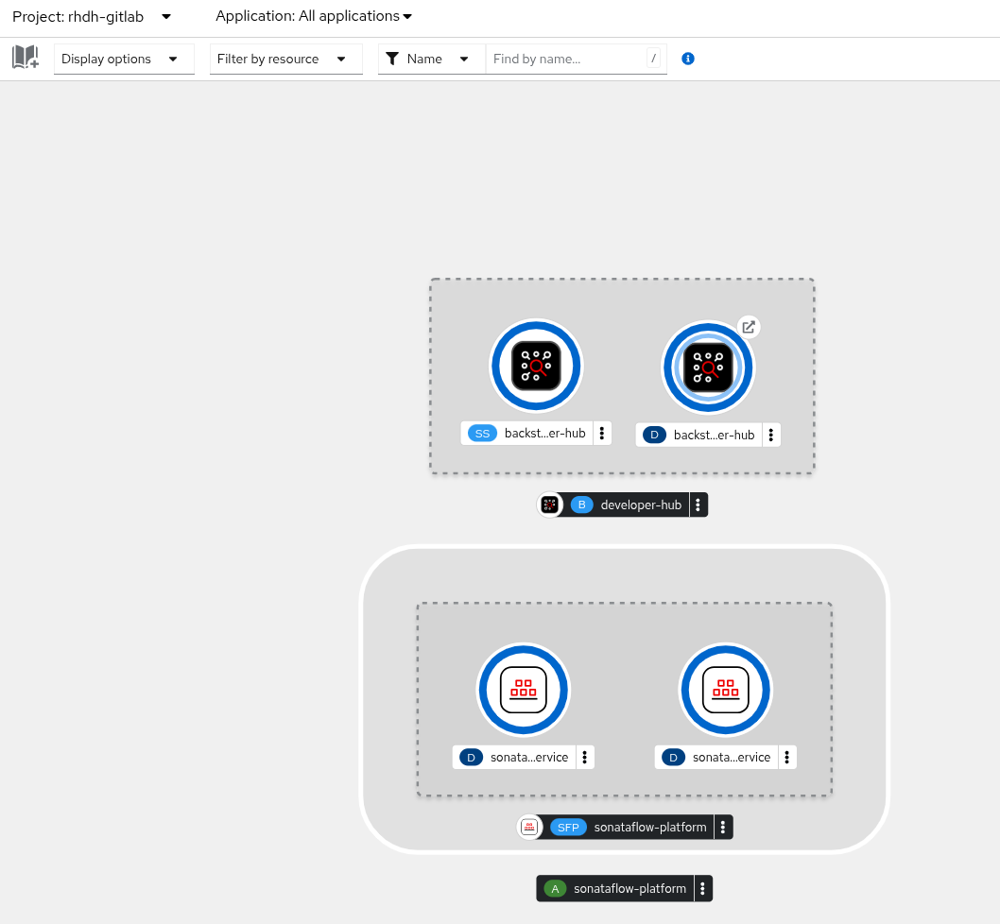
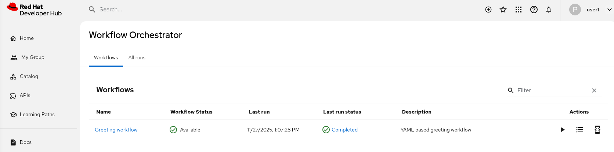

# Enable Orchestrator

Previously we created a component based on a Software Template. However, developer self-service requests might require more than
what a Software Template can provide natively. For example, certain requests might require an approval, while others might involve
long-running, stateful processes - this is where the Orchestrator for Red Hat Developer Hub can help. It addresses the fact that
regular Software Templates are stateless "run and done" processes.

The Orchestrator feature extends Red Hat Developer Hub with support for workflows created using [SonataFlow](https://sonataflow.org/).
The Orchestrator project website and documentation is available at [rhdhorchestrator.io](rhdhorchestrator.io).

The Orchestrator feature effectively acts as an interface between Red Hat Developer Hub and SonataFlow-powered workflows,
providing a listing and the ability view and run workflows directly from Red Hat Developer Hub.

In summary the Orchestrator feature for Red Hat Developer Hub enables teams to create stateful workflows using open standards, and provide them in a self-service manner through their internal developer portal.

To enable running stateful workflows we need to install the OpenShift Serverless Logic Operator:

```shell
oc apply -f ./lab-prep/logic-operator-rhel8-operator.yaml
```

And confirm its successful installation:

```shell
on 🎩 ❯ oc get csv -n openshift-serverless-logic
NAME                            DISPLAY                               VERSION   REPLACES                              PHASE
logic-operator-rhel8.v1.36.0    OpenShift Serverless Logic Operator   1.36.0    logic-operator-rhel8.v1.35.0          Succeeded
```

To enable the Orchestrator feature, we need to enable the following dynamic plugins:

* `@redhat/backstage-plugin-orchestrator`
* `@redhat/backstage-plugin-orchestrator-backend-dynamic`
* `@redhat/backstage-plugin-scaffolder-backend-module-orchestrator-dynamic`
* `@redhat/backstage-plugin-orchestrator-form-widgets`

After enabling the Orchestrator plugin, the RHDH Operator automatically provisions the following required dependencies:

* A `SonataflowPlatform` CR
* `NetworkPolicies` that allow traffic between infrastructure resources (Knative, Serverless Logic Operator), monitoring traffic, and intra-namespace traffic.

As RBAC is enabled, it is needed to add some extra rules to manage the new plugin to allow users to operate with the workflows
installed. Basically we need to extend the RBAC configuration adding the `orchestrator` plugin:

```yaml
    permission:
      enabled: true
      rbac:
        admin:
          users:
            - name: user:default/root
        policies-csv-file: /opt/app-root/src/rbac/rbac-policy.csv
        conditionalPoliciesFile: /opt/app-root/src/rbac/rbac-conditional-policies.yaml
        policyFileReload: true
        pluginsWithPermission:
          - catalog
          - scaffolder
          - permission
          - orchestrator # New Entry
```

And add new RBAC policies to allow or deny the usage of the workflows. For example, we are allowing users of the `team-a` to operate them,
but the users of `team-b` can't execute one of the workflows:

```text
    # Orchestrator permissions
    p, role:default/team-a, orchestrator.workflow, read, allow
    p, role:default/team-a, orchestrator.workflow.use, update, allow
    p, role:default/team-a, orchestrator.workflowAdminView, read, allow
    p, role:default/team-a, orchestrator.instanceAdminView, read, allow 
    # Orchestrator permissions - Unable to execute the greeting workflow
    p, role:default/team-b, orchestrator.workflow.greeting, read, allow
    p, role:default/team-b, orchestrator.workflow.use.greeting, update, deny
```

For more details, review the [permissions documentation](https://github.com/redhat-developer/rhdh-plugins/blob/main/workspaces/orchestrator/docs/Permissions.md) of the Orchestrator plugin.

So, to complete the installation run:

```sh
oc apply -f ./custom-app-config-gitlab/dynamic-plugins-13.yaml -n rhdh-gitlab
oc apply -f ./custom-app-config-gitlab/rhdh-app-configmap-13.yaml -n rhdh-gitlab
oc apply -f ./custom-app-config-gitlab/rbac-policy-configmap-13.yaml -n rhdh-gitlab
```

Return to the Topology View for the `rhdh-gitlab` namespace and wait for the `SonataFlowPlatform` pods to become ready.
It might take a few minutes for both the Red Hat Developer Hub and SonataFlowPlatform pods to become ready and stabilize,
since the SonataFlow pods depend on the new instance of Red Hat Developer Hub to initialize with the newly enabled plugins.

The new topology should looks like as:



No, it is time to deploy a simple workflow and verify its integration into Red Hat Developer Hub. To do it, let's deploy
this sample of Red Hat Advanced Developer Suite repository:

```shell
helm repo add workflows https://redhat-ads-tech.github.io/orchestrator-workflows/
helm install greeting-workflow workflows/greeting -n rhdh-gitlab
```

After some minutes, the workflow should appear in Red Hat Developer Hub as:



Run it and verify the results. 

**NOTE**: If you are logged as a `team-b` member, then you are not allowed to run it.

References:

* [Orchestrator in Red Hat Developer Hub](https://docs.redhat.com/en/documentation/red_hat_developer_hub/1.8/html-single/orchestrator_in_red_hat_developer_hub/index)
