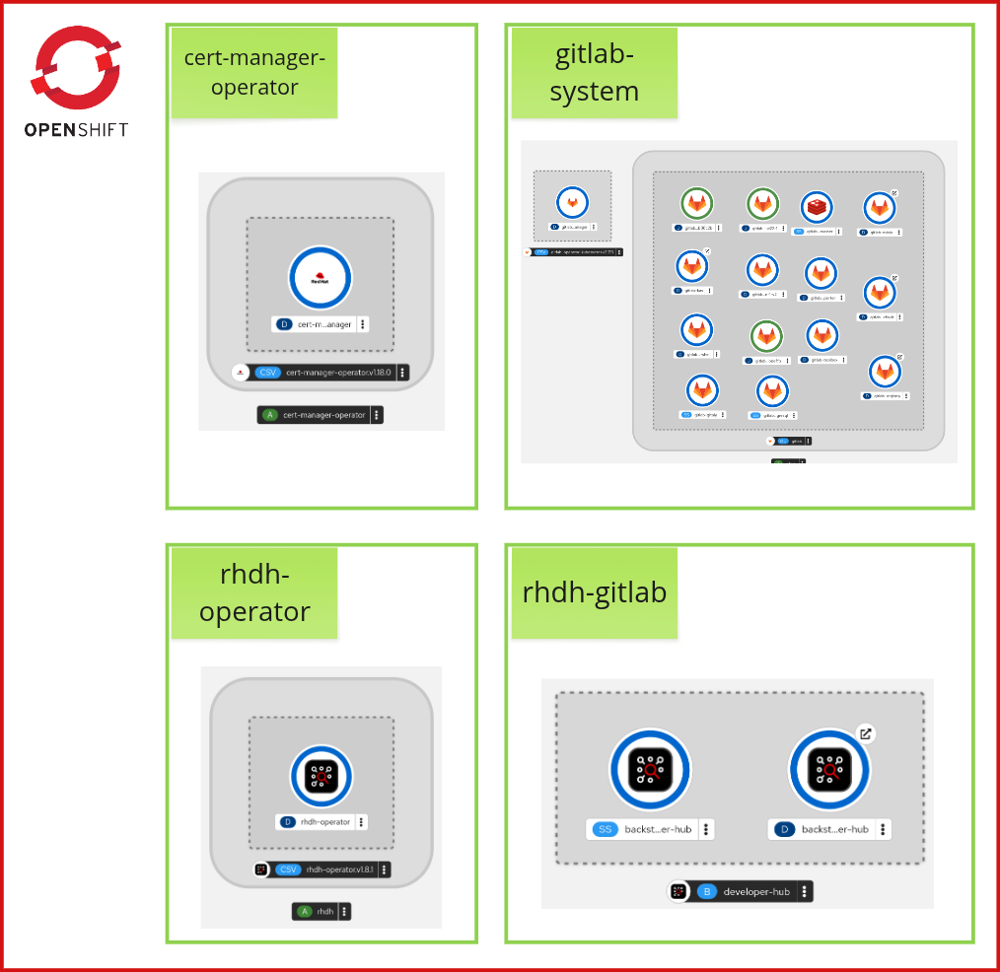

# Red Hat Developer Hub Workshop

This workshop is about setting up Red Hat Developer Hub including some of the most common
configurations. The topology of the components deployed on Red Hat OpenShift is:

The full list of actions implemented in this exercise is:

0. Install Red Hat Developer Hub
1. Enable GitLab authentication
2. Enable GitLab integrations
3. Enable GitLab catalog autodiscovery
4. Enable GitLab user/group autodiscovery
5. Enable RBAC permissions
6. Import Software Templates and create a component
7. Deploy a dynamic plugin
8. Enable Tech Docs
9. Enable High-Availability
10. Enable dynamic plugins cache

Run the lab [preparation instructions](./README-preparation.md) first,
then follow the exercise steps [here](./README-gitlab.md).
