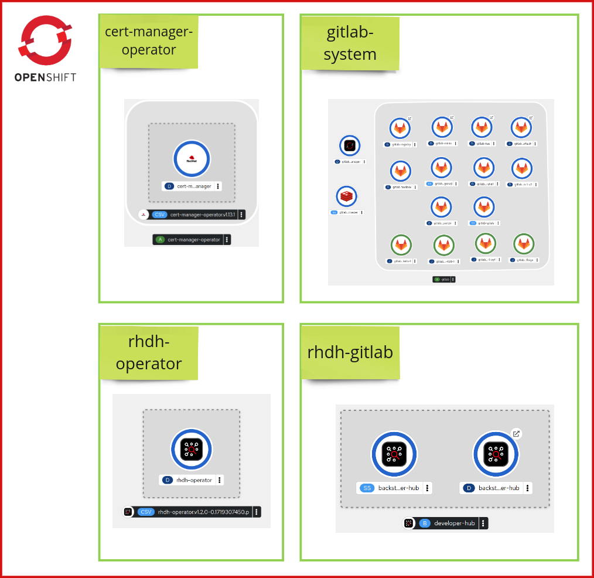

# Red Hat Developer Hub Workshop

## Table of Contents

1. [Overview](#overview)
2. [Topology](#topology)
3. [Preparation Instructions](#preparation-instructions)
4. [Exercise Steps](#exercise-steps)
5. [FAQ](#faq)
6. [Contributing](#contributing)

---

## Overview

This workshop is about setting up Red Hat Developer Hub including some of the most common
configurations.

## Topology

The topology of the components deployed on Red Hat OpenShift is:

## Preparation Instructions

Before starting the exercises of this workshop, there are some [preparations to execute](./README-preparation.md). Please follow them.

## Exercise Steps

The full list of actions implemented in this exercise is:

0. Install Red Hat Developer Hub
1. Enable GitLab authentication
2. Enable GitLab integrations
3. Enable GitLab catalog autodiscovery
4. Enable GitLab user/group autodiscovery
5. Enable RBAC permissions
6. Import Software Templates and create a component
7. Deploy a dynamic plugin
8. Enable Tech Docs
9. Enable High-Availability
10. Enable Dynamic Plugins Cache
11. Enable Monitoring and Observability
12. Enable Notifications
13. Enable Orchestrator
14. AI Labs - Enable Model Context Protocol (MCP)
15. AI Labs - Integrate with Red Hat Developer Lightspeed
16. Enterprise Labs - Use an External Database
17. Enterprise Labs - Enable CI/CD Pipelines

Follow the exercises steps [here](./README-gitlab.md).

## FAQ

If you are facing some issues, please, review our [FAQ.md](./FAQ.md).

## Contributing

We welcome contributions! Please see our [Contributing Guide](./CONTRIBUTING.md) for details on
how to contribute to this project. This project follows the [Contributor Covenant Code of Conduct](./CODE_OF_CONDUCT.md).
